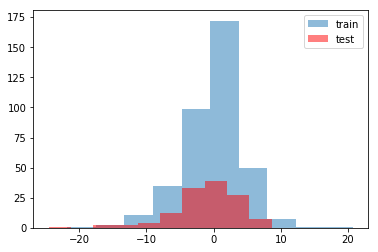
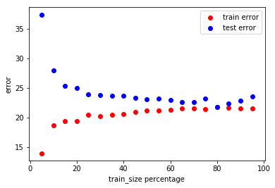

# Regression Model Validation - Lab

## Introduction

In this lab, you'll be able to validate your model using train-test-split.


## Objectives

You will be able to:

- Calculate the mean squared error (MSE) as a measure of predictive performance
- Validate the model using the test data


## Let's use our Boston Housing Data again!

This time, let's only include the variables that were previously selected using recursive feature elimination. We included the code to preprocess below.


```python
import pandas as pd
import numpy as np
import matplotlib.pyplot as plt
%matplotlib inline
from sklearn.datasets import load_boston
from sklearn.model_selection import train_test_split
from sklearn.linear_model import LinearRegression
from sklearn.preprocessing import StandardScaler

boston = load_boston()

boston_features = pd.DataFrame(boston.data, columns = boston.feature_names)
b = boston_features["B"]
logdis = np.log(boston_features["DIS"])
loglstat = np.log(boston_features["LSTAT"])

# minmax scaling
boston_features["B"] = (b-min(b))/(max(b)-min(b))
boston_features["DIS"] = (logdis-min(logdis))/(max(logdis)-min(logdis))

#standardization
boston_features["LSTAT"] = (loglstat-np.mean(loglstat))/np.sqrt(np.var(loglstat))
```


```python
X = boston_features[['CHAS', 'RM', 'DIS', 'B', 'LSTAT']]
y = boston.target
```

## Perform a train-test-split


```python
xtrain, xtest, ytrain, ytest = train_test_split(X, y, test_size=0.25)
```


```python
print(xtrain.shape, xtest.shape, ytrain.shape, ytest.shape)
```

    (379, 5) (127, 5) (379,) (127,)


## Apply your model to the train set

#### Importing and initializing the model class


```python
model = LinearRegression()
```

#### Fitting the model to the train data


```python
model.fit(xtrain, ytrain)
```


    LinearRegression(copy_X=True, fit_intercept=True, n_jobs=1, normalize=False)


#### Calculating predictions on the train set, and on the test set


```python
yhat_train = model.predict(xtrain)
yhat_test  = model.predict(xtest)
```

#### Calculating your residuals


```python
train_residuals = yhat_train - ytrain
test_residuals  = yhat_test  - ytest
```

#### Calculating the Mean Squared Error
A good way to compare overall performance is to compare the mean squarred error for the predicted values on the train and test sets.


```python
def mse(ypred, ytrue):
    """
    formula = 1/n * sum(fi-yi); where fi = model_value, yi=true_value
    input
    ypred: array of predictions
    ytrue: array of true values (with respect to our ypred)
    
    output
    mse: float
    """
    N = ypred.shape[0]
    # print(N)
    return float(np.sum(np.square(ypred-ytrue)))/N
```


```python
mse_train = mse(yhat_train, ytrain)
mse_test  = mse(yhat_test,  ytest)
print(mse_train, mse_test) # mean squared error
print(np.sqrt(mse_train), np.sqrt(mse_test)) # root mean squared error
```

    20.486704679944115 26.011381865394974
    4.526224108453327 5.100135475200141


# histogram of residuals


```python
plt.hist(train_residuals, label='train',alpha=0.5)
plt.hist(test_residuals, color='r', label='test', alpha=0.5)
plt.legend()
plt.show()
```





If your test error is substantially worse then our train error, this is a sign that our model doesn't generalize well to future cases.

One simple way to demonstrate overfitting and underfitting is to alter the size of our train test split. By default, scikit learn's built in method allocates 25% of the data to the test set and 75% to the training set. Fitting a model on only 10% of the data is apt to lead to underfitting, while training a model on 99% of the data is apt to lead to overfitting.

# Evaluating the effect of train-test split size

Iterate over a range of train-test split sizes from .5 to .95. For each of these, generate a new train/test split sample. Fit a model to the training sample and calculate both the training error and the test error (mse) for each of these splits. Plot these two curves (train error vs. training size and test error vs. training size) on a graph.


```python
train_sizes = [i for i in range(5, 100, 5)]
test_sizes  = [100 - i for i in train_sizes]
train_error = []
test_error  = []
```


```python
for index, train_size in enumerate(train_sizes):
    # train-test split
    mse_tr_iter = []
    mse_te_iter = []
    for iteration in range(100):
        xtr, xte, ytr, yte = train_test_split(X, y, train_size=0.01*train_size)

        # model init/fit
        linreg = LinearRegression()
        linreg.fit(xtr, ytr)

        # get yhats for train/test
        yhat_tr = linreg.predict(xtr)
        yhat_te = linreg.predict(xte)

        # calculate mse_tr and mse_te
        mse_tr = mse(yhat_tr, ytr)
        mse_te = mse(yhat_te, yte)

        # append values to error lists
        mse_tr_iter.append(mse_tr)
        mse_te_iter.append(mse_te)
    mse_tr_avg = np.array(mse_tr_iter).mean()
    mse_te_avg = np.array(mse_te_iter).mean()
    
    train_error.append(mse_tr_avg)
    test_error.append(mse_te_avg)
```

    /anaconda3/lib/python3.6/site-packages/sklearn/model_selection/_split.py:2026: FutureWarning: From version 0.21, test_size will always complement train_size unless both are specified.
      FutureWarning)


# Evaluating the effect of train-test split size: extension

Repeat the previous example, but for each train-test split size, generate 100 iterations of models/errors and save the average train/test error. This will help account for any particularly good/bad models that might have resulted from poor/good splits in the data. 


```python
plt.scatter(x=train_sizes, y=train_error, c='r', label='train error')
plt.scatter(x=train_sizes, y=test_error, c='b', label='test error')
plt.xlabel("train_size percentage")
plt.ylabel("error")
plt.legend()
plt.show()
```





```python

```


    <matplotlib.legend.Legend at 0x1a26e93438>


What's happening here? evaluate your result!

##  Summary 

Congratulations! You now practiced your knowledge on MSE and on using train-test-split.
