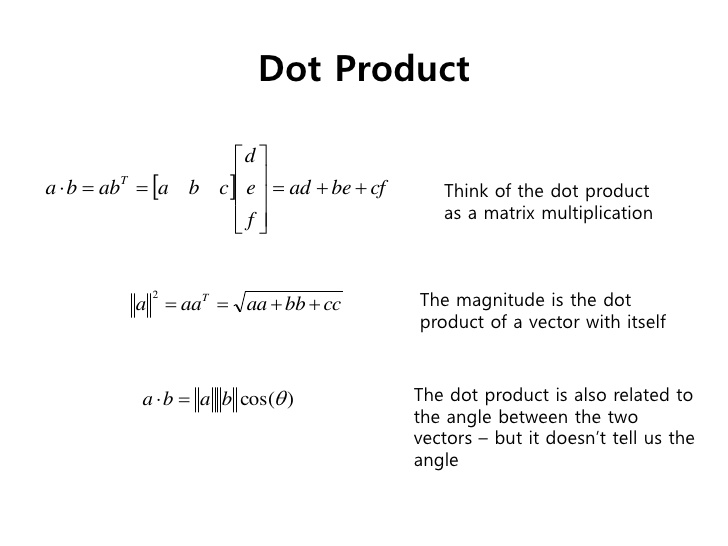

# Linear algebra!!!!

# Objectives
* YWBAT
  * describe the difference between numpy.dot and actual dot products
  * describe how to solve a system of equations using linear algebra
  * solve a system of equations using linear algebra in numpy
  * identify if a matrix is transposed, inversed
  * verify (check) the solutions to a system of equations in python

# Linear Algebra dot products -> Scalar


# Numpy.dot()
```
np.dot()
```
```
dot(a, b, out=None)

Dot product of two arrays. Specifically,

- If both `a` and `b` are 1-D arrays, it is inner product of vectors
  (without complex conjugation).

- If both `a` and `b` are 2-D arrays, it is matrix multiplication,
  but using :func:`matmul` or ``a @ b`` is preferred.

- If either `a` or `b` is 0-D (scalar), it is equivalent to :func:`multiply`
  and using ``numpy.multiply(a, b)`` or ``a * b`` is preferred.

- If `a` is an N-D array and `b` is a 1-D array, it is a sum product over
  the last axis of `a` and `b`.

- If `a` is an N-D array and `b` is an M-D array (where ``M>=2``), it is a
  sum product over the last axis of `a` and the second-to-last axis of `b`::

    dot(a, b)[i,j,k,m] = sum(a[i,j,:] * b[k,:,m])


Parameters
----------
a : array_like
    First argument.
b : array_like
    Second argument.
out : ndarray, optional
    Output argument. This must have the exact kind that would be returned
    if it was not used. In particular, it must have the right type, must be
    C-contiguous, and its dtype must be the dtype that would be returned
    for `dot(a,b)`. This is a performance feature. Therefore, if these
    conditions are not met, an exception is raised, instead of attempting
    to be flexible.

Returns
-------
output : ndarray
    Returns the dot product of `a` and `b`.  If `a` and `b` are both
    scalars or both 1-D arrays then a scalar is returned; otherwise
    an array is returned.
    If `out` is given, then it is returned.
```


```python
import numpy as np
np.random.seed(42)
```


```python
# vector a of random integers between 1 and 10 (1, 3)
a = np.random.randint(1, 10, size=(1, 3)) # notice I define the 1, not a vector
a
```


    array([[7, 4, 8]])


```python
# vector b similar to a
b = np.random.randint(1, 10, size=(1, 3)) #notice I define the 1, not a vector
b
```


    array([[5, 7, 3]])


```python
# check the dot product manually
5*7 + 7*4 + 3*8
```


    87


```python
# dot product array output
print(a.dot(b.transpose())) # returns an array
# grab the scalar by indexing the row and column 
print(a.dot(b.transpose())[0][0])
```

    [[87]]
    87


```python
# create an actual vector
aa = np.random.randint(1, 10, size=(3, )) # notice I don't define the 1, not a vector
aa

# compare aa to a from before
# aa is a list (array/vector)
# a is a list of lists
```


    array([3, 6, 5])


```python
cc = np.random.randint(1, 10, size(, 3)) # will not work because vectors are defined by row dimension and not column dimension
```


      File "<ipython-input-108-59833c075859>", line 1
        cc = np.random.randint(1, 10, size(, 3)) # will not work because vectors are defined by row dimension and not column dimension
                                           ^
    SyntaxError: invalid syntax


```python
bb = np.random.randint(1, 10, size=(3, )) # notice I don't define the 1, not a vector
bb 
# similarly bb is a list and not a list of lists
```


    array([2, 8, 6])


```python
aa.dot(bb.transpose()) # returns a scalar
```


    84


```python
# using np.dot()
# we're going to use np.dot() instead of object.dot()
np.dot(a, b.transpose())

# returns the same as a.dot(b.transpose())
```


    array([[87]])


```python
# using np.dot()
np.dot(aa, bb.transpose())
# returns the same as aa.dot(bb.transpose())
```


    84


# Why transpose? 
## Inner dimensions must match 
a -> (1, 3)
b -? (1, 3)

(1, 3) * (1, 3) -> Inner dimensions are 3 and 1


```python
a.dot(b) # will not work since inner dimensions don't match
```


    ---------------------------------------------------------------------------

    ValueError                                Traceback (most recent call last)

    <ipython-input-106-4384694f89da> in <module>()
    ----> 1 a.dot(b) # will not work since inner dimensions don't match
    

    ValueError: shapes (1,3) and (1,3) not aligned: 3 (dim 1) != 1 (dim 0)


```python
# Notice transpose flips the dimensions
print(b.shape)
print(b.transpose().shape)
```

    (1, 3)
    (3, 1)


```python
# multiplication (python)
print(a)
print(b)
print(a*b) # notice this returns array 

# comparing dot() to multiplication * in python

# how can I get a dot product from this?
print(sum(a*b)) # sum a*b gives an array of the first row
print(sum(sum(a*b))) # double sum will pull out first row and then sum the elements

print(np.sum(a*b)) # np.sum() sums all the elements
```

    [[7 4 8]]
    [[5 7 3]]
    [[35 28 24]]
    [35 28 24]
    87
    87


```python
# what does python multiplication do? 
```


```python
# using multiplication (arrays)
%time
a*b # -> array (list of lists)
```

    CPU times: user 3 µs, sys: 0 ns, total: 3 µs
    Wall time: 8.11 µs


    array([[35, 28, 24]])


```python
# using multiplication (vectors)
%time
aa*bb # returns an array (just a list)
```

    CPU times: user 2 µs, sys: 1 µs, total: 3 µs
    Wall time: 7.15 µs


    array([ 6, 48, 30])


* vector multiplication and matrix multiplication (inner dimensions need to match)
* different packages handle multiplication differently
    * python multiplication will do element wise multiplication and maintains types
    * dot() on vectors returns scalar
    * dot() on matrices returns a matrix
    * dot() in numpy is different than LinAlg dot because 
        * covers mult on more than just vectors
        * does not always return a scalar


```python
%time
np.multiply(a, b) # same as python mult
```

    CPU times: user 3 µs, sys: 1e+03 ns, total: 4 µs
    Wall time: 7.15 µs


    array([[35, 28, 24]])


```python
%time
np.multiply(aa, bb)
```

    CPU times: user 3 µs, sys: 1 µs, total: 4 µs
    Wall time: 5.96 µs


    array([ 6, 48, 30])


# Systems of Equations / Inverses

# Math inverses -> multiply to get 1
# Opposites -> add to 0
What is the inverse of 3?


$ 3*-3 = -9 $ -3 is the opposite of 3 not the inverse


$ 3\frac{1}{3} = 1$ this is an inverse

# Inverses
$ A^{-1} A = I $

# Matrices that don't have inverses
* Zero matrices don't have inverses
* Matrices who's determinate equals 0 (Scalar name for a matrix)


```python
A = np.random.randint(1, 10, size= (2,2))
b = np.random.randint(1, 100, size=(2, 1))
print(A)
print(b)
```

    [[2 5]
     [1 6]]
    [[89]
     [49]]


# Systems
$ Ax = b $

$ A^{-1}Ax = A^{-1}b $

$ x = A^{-1}b $


what is x? 
(2, 2) (2, 1) = (2, 1) 

x is a vector that is 2x1


```python
Ainv = np.linalg.inv(A)
Ainv
```


    array([[ 0.85714286, -0.71428571],
           [-0.14285714,  0.28571429]])


```python
left = Ainv.dot(A)
```


```python
# solve a system of equations in numpy
x_vector = Ainv.dot(b)
x_vector
```


    array([[41.28571429],
           [ 1.28571429]])


```python
# check your solution (x_vector)
print(A.dot(x_vector))
print(b)
print(A.dot(x_vector)==b)
```

    [[89.]
     [49.]]
    [[89]
     [49]]
    [[ True]
     [ True]]


# this will work every time, right?
* Not really, A has to be invertable

# Steps to solving a system of equations (Ax = b)
* Make sure A has an inverse 
* solve for x_vector = Ainv.dot(b) 
* check that ```A.dot(x_vector) == b```
